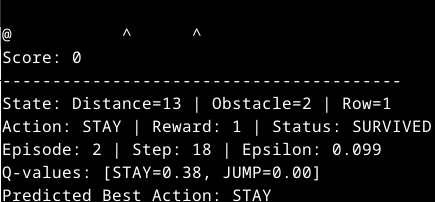

# DinoRL

DinoRL is a Q-learning-based game where an agent learns to navigate a 2D grid, dodging obstacles (trees and birds) by choosing to stay or jump. The project demonstrates reinforcement learning concepts with a simple, interactive interface.

## Features
- Q-learning algorithm for training an agent to avoid obstacles.
- Interactive menu to train, test, save/load agent state, and save configuration.
- Support for multiple obstacles to increase game complexity.
- Progress bars for training and testing using \`tqdm\`.
- Configurable game settings via JSON (\`game_config.json\`).
- Logging to both console and file (\`game.log\`).

## Project Structure
- \`agent.py\`: Implements the Q-learning agent and state management.
- \`config.py\`: Defines game configuration and enums for actions/obstacles.
- \`environment.py\`: Manages the game grid, agent, and obstacle dynamics.
- \`main.py\`: Runs the main program with a menu interface.
- \`renderer.py\`: Handles console-based rendering of the game state.
- \`requirements.txt\`: Lists dependencies (\`tqdm\`, \`numpy\`).
- \`LICENSE.txt\`: MIT License for the project.
- \`imag.png\`: Screenshot or illustrative image of the game.

## Prerequisites
- Python 3.6 or higher.
- A terminal or command-line interface.
- Optional: A virtual environment for dependency isolation.

## Setup
1. **Clone or Navigate to the Project Directory**:
   \`\`\`bash
   cd ~/Área\ de\ trabalho/Deposit/Meus\ projetos/DinoRL
   \`\`\`

2. **Create and Activate a Virtual Environment** (optional but recommended):
   \`\`\`bash
   python3 -m venv venv
   source venv/bin/activate
   \`\`\`

3. **Install Dependencies**:
   Ensure \`requirements.txt\` is present with:
   \`\`\`
   tqdm>=4.66.5
   numpy>=1.26.4
   \`\`\`
   Install the dependencies:
   \`\`\`bash
   pip3 install -r requirements.txt
   \`\`\`

## Running the Project
1. **Run the Main Script**:
   \`\`\`bash
   python3 main.py
   \`\`\`

2. **Interact with the Menu**:
   - **Train Agent**: Train the agent for a specified number of episodes (default: 1000).
   - **Test Agent**: Test the trained agent for a specified number of episodes (default: 1).
   - **Save Agent State**: Save the Q-table and epsilon to a JSON file (default: \`agent_state.json\`).
   - **Load Agent State**: Load a saved agent state from a JSON file.
   - **Save Configuration**: Save the current game configuration to a JSON file (default: \`game_config.json\`).
   - **Exit**: Terminate the program.

## Configuration
- Edit \`game_config.json\` (created after saving configuration) to adjust settings like:
  - \`width\`, \`height\`: Game grid dimensions.
  - \`max_obstacles\`: Maximum number of simultaneous obstacles (default: 2).
  - \`learning_rate\`, \`discount_factor\`: Q-learning parameters.
  - \`render_delay\`: Delay between rendered frames (default: 0.1 seconds).

## Logging
- Logs are written to \`game.log\` and displayed in the console.
- Includes episode summaries, state saving/loading, and errors.
- Enable debug logging by modifying \`setup_logging\` in \`main.py\` (set \`level=logging.DEBUG\`).

## License
This project is licensed under the MIT License. See the [LICENSE.txt](LICENSE.txt) file for details.

## Dependencies
- \`tqdm\`: Provides progress bars for training and testing (MPLv2/MIT License).
- \`numpy\`: Optimizes array operations for Q-learning (BSD License).

